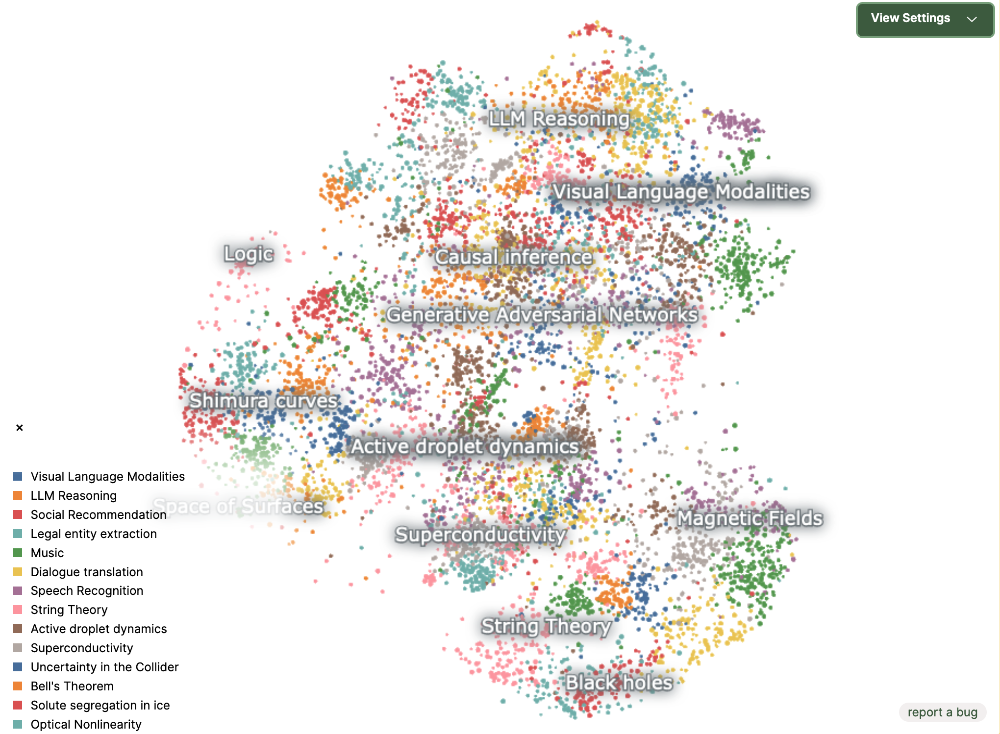
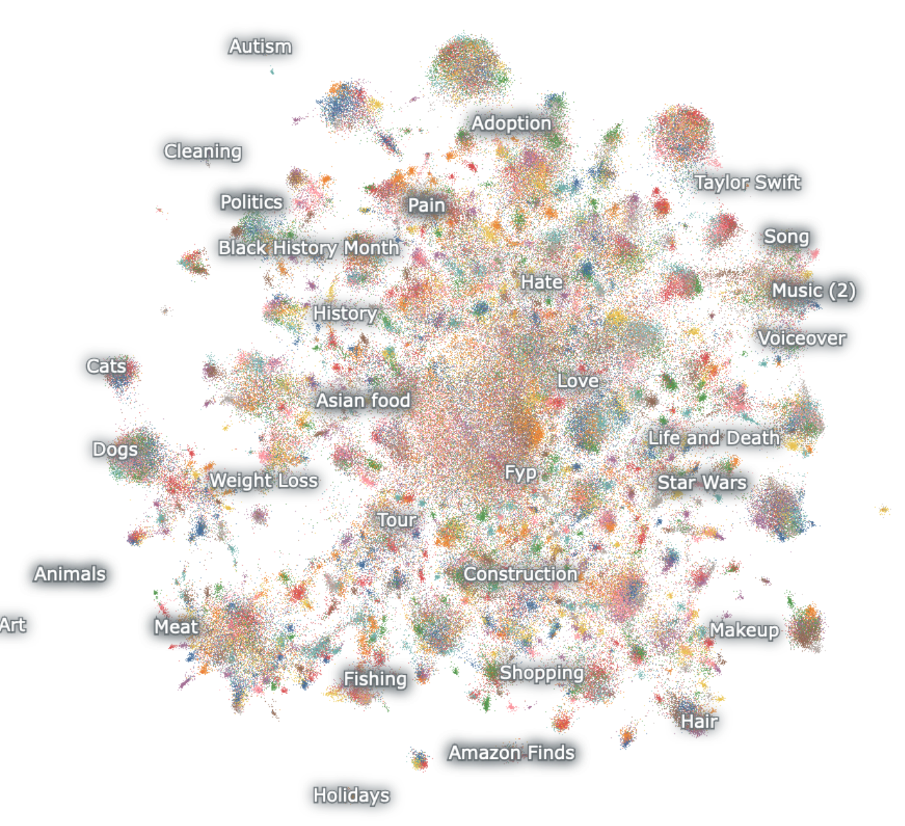

<h1 align="center">Nomic Atlas Python Client</h1>
<h3 align="center">Explore, label, search and share massive datasets in your web browser.</h3>
<p>This repository contains Python bindings for working with <a href="https://atlas.nomic.ai/">Nomic Atlas</a>, the world’s most powerful unstructured data interaction platform. Atlas supports datasets from hundreds to tens of millions of points, and supports data modalities ranging from text to image to audio to video. </p>

With Nomic Atlas, you can:

- Generate, store and retrieve embeddings for your unstructured data.
- Find insights in your unstructured data and embeddings all from your web browser.
- Share and present your datasets and data findings to anyone.

 <a href="https://www.phorm.ai/query?projectId=755eecd3-24ad-49cc-abf4-0ab84caacf63"></a>

### Where to find us?

[https://atlas.nomic.ai/](https://atlas.nomic.ai/)

<table>
  <tr>
    <td>
      
      <br>
      <center><i><a href="https://atlas.nomic.ai/map/ad82766d-3519-4c93-94c6-931dee0a7016/fab1d389-7d83-4bc6-b2bc-abc9fb50f808">Articles Submitted to Arxiv (10/12/2023 - 10/19/2023)</a></i></center>
    </td>
    <td>
      
      <br>
      <center><i><a href="https://atlas.nomic.ai/map/eef7bc87-0c68-4d14-be83-157327d1e355/e3b74502-c9a4-4b24-9bbf-c9f708688ac6">Historical TikTok Dataset (Indexed on Metadata Descriptions)</a></i></center>
    </td>
  </tr>
</table>

## Table of Contents

- [Quick resources](#quick-resources)
  - [Example maps](#example-maps)
- [Features](#features)
- [Quickstart](#quickstart)
  - [Installation](#installation)
  - [Make your first map](#make-your-first-map)
- [Atlas usage examples](#atlas-usage-examples)
  - [Access your embeddings](#access-your-embeddings)
  - [View your data's topic model](#view-your-datas-topic-model)
  - [Search for data semantically](#search-for-data-semantically)
- [Documentation](#documentation)
- [Discussion](#discussion)
- [Community](#community)

## Quick Resources

<p >
  Try the <a href="https://colab.research.google.com/drive/1CZBo3LV0FoRTVRN3v068tvNJgbeWpcSX?usp=sharing">:notebook: Colab Demo</a> to get started in Python
</p>

<p>
  Read the <a href="https://docs.nomic.ai">:closed_book:	 Atlas Docs</a>
</p>

<p>
  Join our <a href="https://discord.gg/myY5YDR8z8">:hut: Discord</a> to start chatting and get help
</p>

#### Example maps

<a href="https://atlas.nomic.ai/map/twitter">:world_map: Map of Twitter</a> (5.4 million tweets)
<br> <br>
<a href="https://atlas.nomic.ai/map/stablediffusion">:world_map: Map of StableDiffusion Generations</a> (6.4 million images)
<br> <br>
<a href="https://atlas.nomic.ai/map/neurips">:world_map: Map of NeurIPS Proceedings</a> (16,623 abstracts)

</p>

## Features

Here are just a few of the features which Atlas offers:

- Organize your **text, image, and embedding data**
- Create **beautiful and shareable** maps **with or without coding knowledge**
- Have easy access to both **high-level data structures** and **individual datapoints**
- **Search** millions of datapoints **instantly**
- **Cluster data** into semantic topics
- **Tag and clean** your dataset
- **Deduplicate** text, images, video, audio


## Quickstart

### Installation

1. Install the Nomic library

```bash
pip install nomic
```

2. Login or create your Nomic account:

```bash
nomic login
```

3. Follow the instructions to obtain your access token.

```bash
nomic login [token]
```

### Make your first map

```python
from nomic import atlas
import numpy as np

# Randomly generate a set of 10,000 high-dimensional embeddings
num_embeddings = 10000
embeddings = np.random.rand(num_embeddings, 256)

# Create Atlas project
dataset = atlas.map_data(embeddings=embeddings)

print(dataset)
```

## Atlas usage examples

### Access your embeddings

Atlas stores, manages and generates embeddings for your unstructured data.

You can access Atlas latent embeddings (e.g. high dimensional) or the two-dimensional embeddings generated for web display.

```python
# Access your Atlas map and download your embeddings
map = dataset.maps[0]

projected_embeddings = map.embeddings.projected
latent_embeddings = map.embeddings.latent
```

```python
print(projected_embeddings)
```

```
# Response:
id 	x 	y
0 	9.815330 	-8.105308
1 	-8.725819 	5.980628
2 	13.199472 	-1.103389
... 	... 	... 	...
```

```python
print(latent_embeddings)
```

```
# Response:
n x d numpy.ndarray where n = number of datapoints and d = number of latent dimensions
```

### View your data’s topic model

Atlas automatically organizes your data into topics informed by the latent contents of your embeddings. Visually, these are represented by regions of homogenous color on an Atlas map.

You can access and operate on topics programmatically by using the `topics` attribute
of an AtlasMap.

```python
# Access your Atlas map
map = dataset.maps[0]

# Access a pandas DataFrame associating each datum on your map to their topics at each topic depth.
topic_df = map.topics.df

print(map.topics.df)

```

```
Response:

id topic_depth_1 topic_depth_2
0 Oil Prices mergers and acquisitions
1 Iraq War Trial of Thatcher
2 Oil Prices Economic Growth
... ... ... ...
9997 Oil Prices Economic Growth
9998 Baseball Giambi's contract
9999 Olympic Gold Medal European Football

```

### Search for data semantically

Use Atlas to automatically find nearest neighbors in your vector database.

```python
# Load map and perform vector search for the five nearest neighbors of datum with id "my_query_point"
map = dataset.maps[0]

with dataset.wait_for_dataset_lock():
  neighbors, _ = map.embeddings.vector_search(ids=['my_query_point'], k=5)

# Return similar data points
similar_datapoints = dataset.get_data(ids=neighbors[0])

print(similar_datapoints)
```

```
Response:

Original query point:
"Intel abandons digital TV chip project NEW YORK, October 22 (newratings.com) - Global semiconductor giant Intel Corporation (INTC.NAS) has called off its plan to develop a new chip for the digital projection televisions."

Nearest neighbors:
"Intel awaits government move on expensing options Figuring it's had enough of fighting over options, the chip giant is waiting to see what Congress comes up with."
"Citigroup Takes On Intel The financial services giant takes over non-memory semiconductor chip production."
"Intel Seen Readying New Wi-Fi Chips  SAN FRANCISCO (Reuters) - Intel Corp. this week is  expected to introduce a chip that adds support for a relatively  obscure version of Wi-Fi, analysts said on Monday, in a move  that could help ease congestion on wireless networks."
"Intel pledges to bring Itanic down to Xeon price-point EM64T a stand-in until the real anti-AMD64 kit arrives"
```

## Background

Atlas is developed by the [Nomic AI](https://home.nomic.ai/) team, which is based in NYC. Nomic also developed and maintains [GPT4All](https://gpt4all.io/index.html), an open-source LLM chatbot ecosystem.

## Discussion

Join the discussion on our [:hut: Discord](https://discord.gg/myY5YDR8z8) to ask questions, get help, and chat with others about Atlas, Nomic, GPT4All, and related topics. Our doors are open to enthusiasts of all skill levels.

## Community

- Blog: [https://blog.nomic.ai/](https://blog.nomic.ai/)
- Twitter: [https://twitter.com/nomic_ai](https://twitter.com/nomic_ai)
- Nomic Website: [https://home.nomic.ai/](https://home.nomic.ai/)
- Atlas Website: [https://atlas.nomic.ai/](https://atlas.nomic.ai/)
- GPT4All Website: [https://gpt4all.io/index.html](https://gpt4all.io/index.html)
- LinkedIn: [https://www.linkedin.com/company/nomic-ai](https://www.linkedin.com/company/nomic-ai)

<br>

[Go to top](#)
