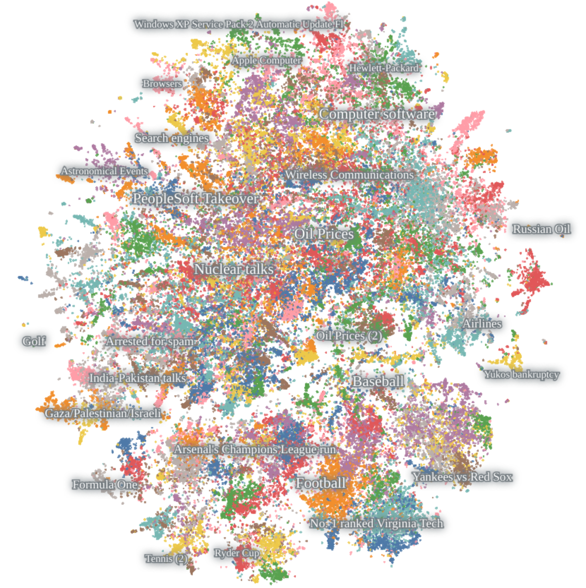

# How Atlas Works

Atlas is a platform for visually and programmatically interacting with massive unstructured datasets of text documents,
images and embeddings.

## Data model
Atlas lets you store and manipulate data like a standard noSQL document engine. On upload, your data is stored in an
abstraction called a `Project`. You can add, update, read and delete (CRUD) data in a project via API calls from the
Atlas Python client.

#### What kind of data can I store in Atlas?
Atlas can natively store:

* [Embedding vectors](https://vaclavkosar.com/ml/Embeddings-in-Machine-Learning-Explained)
* Text Documents

Our roadmap includes first class support for data modalities
such as images, audio and video. You can still store images, audio and video in Atlas now but you must generate embeddings
for it yourself.

Data stored in an Atlas `Project` is semantically indexed by Atlas. This indexing allows you to interact, view and search
through your dataset via meaning instead of matching on words.

#### How does Atlas semantically index data?

Atlas semantically indexes unstructured data by:

1. Converting data points into embedding vectors (if they aren't embeddings already)
2. Organizing the embedding vectors for *fast semantic search* and *human interpretability*

If you have embedding vectors of your data from an embedding API such as OpenAI or Cohere, you can attach them during upload.

If you don't already have embedding vectors for your data points, Atlas will create them by running your data through neural networks that
semantically encode your data points. For example, if you upload text documents Atlas will run them through neural networks that semantically encode text.
It is often cheaper and faster to use Atlas' internal embedding models as opposed to an external model APIs.

## How is Atlas different from a noSQL database?
Unlike existing data stores, Atlas is built with embedding vectors as first class citizens.
[Embedding vectors](https://vaclavkosar.com/ml/Embeddings-in-Machine-Learning-Explained) are representations
of data that computers can semantically manipulate. Most operations you do in Atlas, under the hood, are performed
on embeddings.

## Atlas makes embeddings human interpretable
Despite their utility, embeddings cannot be easily interpreted because they reside in high dimensions.

During indexing, Atlas builds a contextual [two-dimensional data map](https://atlas.nomic.ai/map/stablediffusion) of embeddings.
This map preserves high-dimensional relationships present between embeddings in a two-dimensional, human interpretable view.

### Reading an Atlas Map
Atlas Maps lay out your dataset contextually. We will use the above [map of news articles](https://atlas.nomic.ai/map/22bb6eb0-04c9-4aa0-a138-d860b83c1057/229deb96-fc59-4d40-acb6-52b32590887f) generated by Atlas to describe how to read Maps.

An Atlas Map has the following properties:

1. **Points close to each other on the map are semantically similar/related**. For example, all news articles about sports are at the bottom of the map. Inside the sports region, the map breaks down by type of sport because news articles about a fixed sport (e.g. baseball) have more similarity to each other than with news articles about other types of sports (e.g. tennis).
2. **Relative distances between points correlate with semantic relatedness but the numerical distance between 2D point positions does not have meaning**. For example, the observation that the Tennis and Golf news article clusters are adjacent signify a relationships between Tennis and Golf in the embedding space. You should not, however, make claims or draw conclusions using the Euclidean distance between points in the two clusters. Distance information is only meaningful in the ambient embedding space and can be retrieved with [vector_search](vector_search_in_atlas.md).
3. **Floating labels correspond to distinct topics in your data**. For example, the Golf cluster has the label 'Ryder Cup'. Labels are automatically determined from the textual contents of your data and are crucial for navigating the Map.
4. **Topics have a hierarchy**. As you zoom around the Map, more granular versions of topics will emerge.
4. **Maps update as your data updates**. When new data enters your project, Atlas can reindex the map to reflect how the new data relates to existing data.

All information and operations that are visually presented on an Atlas map have a programmatic analog. For example, you can access topic information and vector search through the Python client.

#### Technical Details
Atlas visualizes your embeddings in two-dimensions using a non-linear dimensionality reduction algorithm. Atlas' dimensionality reduction algorithm is custom-built for scale, speed and dynamic updates.
Nomic cannot share the technical details of the algorithm at this time.

#### Data Formats and Integrity

Atlas stores and transfers data using a subset of the [Apache Arrow](arrow.apache.org) standard.

`pyarrow` is used to convert python, pandas, and numpy data types to Arrow types;
you can also pass any Arrow table (created by polars, duckdb, pyarrow, etc.) directly to Atlas
and the types will be automatically converted.

Before being uploaded, all data is converted with the following rules:

* Strings are converted to Arrow strings and stored as UTF-8.
* Integers are converted to 32-bit integers. (In the case that you have larger integers, they are probably either IDs, in which case you should convert them to strings;
or they are a field that you want perform analysis on, in which case you should convert them to floats.)
* Floats are converted to 32-bit (single-precision) floats.
* Embeddings, regardless of precision, are uploaded as 16-bit (half-precision) floats, and stored in Arrow as FixedSizeList.
* All dates and datetimes are converted to Arrow timestamps with millisecond precision and no time zone.
  (If you have a use case that requires timezone information or micro/nanosecond precision, please let us know.)
* Categorical types (called 'dictionary' in Arrow) are supported, but values stored as categorical must be strings.

Other data types (including booleans, binary, lists, and structs) are not supported.
Values stored as a dictionary must be strings.

All fields besides embeddings and the user-specified ID field are nullable.

## Permissions and Privacy

To create a Project in Atlas, you must first sign up for an account and obtain an API key. 

Projects you create in Atlas have configurable permissions and privacy levels.

When you create a project, it's ownership is assigned to your Atlas team. You can add people to this team to collaborate on projects together.
For example, if you want to invite somone to help you tag points on an Atlas Map, you would add them to your team and give them the appropriate editing permissions on your project.

